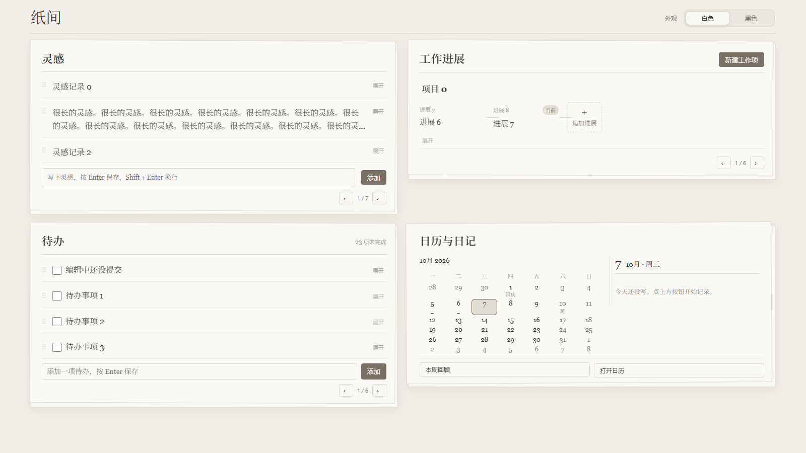
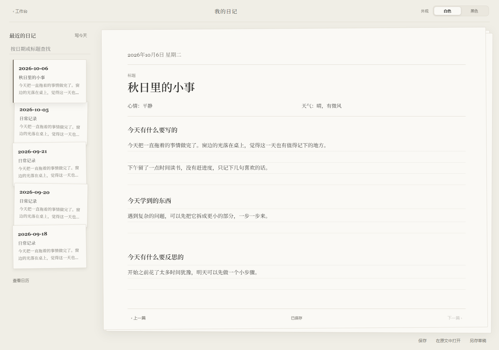

# 纸间 · 个人工作台

纸间是一个 Obsidian 个人工作台，把灵感、待办、工作进展和日记放在一张张纸上。支持白色与黑色两套完整主题。



## 功能

- **自动翻纸首页**：内容多时在模块内左右翻页，支持箭头和横向滑动；桌面空间足够时尽量保持一屏。小窗口保留纵向滚动。
- **克制的纸面布局**：主要模块保留纸叠，条目用横线区分；次要操作在悬停或键盘选中时显示。
- **工作进展**：支持项目、进展步骤和关联文档；首页展示近期步骤，展开后查看全部内容。灵感和待办可以拖入工作进展。
- **六项日记**：标题、心情、天气、今天有什么要写的、今天学到的东西、今天有什么要反思的。心情和天气手动填写。
- **往日日记纸叠**：按日期切换、查找日记，支持自动保存和原文编辑。保存遇到外部修改时保留草稿，避免覆盖原文。
- **完整主题切换**：白色为奶油白与米灰，黑色为暖炭灰；滑动、点击或方向键切换，记住选择。



## 安装或升级

1. 下载最新 Release 的 ZIP，解压。
2. 将 `plugins/dandan-workstation-home` 放入你的仓库 `.obsidian/plugins/`。升级时只覆盖安装包中的程序文件，保留已有 `data.json`、`appearance-preferences.json` 和 `journal-drafts.json`。
3. 将 `snippets/` 中的 CSS 放入 `.obsidian/snippets/`，在「设置 → 外观 → CSS 代码片段」启用 `codex-homepage` 和 `beige-workstation`。
4. 在「设置 → 第三方插件」启用「纸间 · 个人工作台」，重启或重新加载 Obsidian。

命令面板可打开工作台、纸张日记和日记日历。默认日记文件夹为 `日记`；可以在插件设置中修改。

插件 ID 保持 `dandan-workstation-home`，以便已有用户直接升级。不要用整个 `.obsidian` 文件夹覆盖个人仓库设置；仓库中的通用配置仅供新建仓库参考。

## 数据与旧日记

个人日记仍存为仓库中的 Markdown。项目不上传日记、灵感、待办、工作进展、运行缓存、草稿或工作区布局。

旧日记打开时不会被自动迁移。编辑保存后，自由记录和旧版收获／反思章节会映射到新结构，保留其他属性及正文内容。

## 开发与验证

```sh
npm install
npm run build
npm run check
npm test
npx playwright install chromium
npm run test:ui
```

当前源码位于 `.obsidian/plugins/dandan-workstation-home/`：

- `runtime-base.js`：保留原有工作台、日历和文档功能的运行基线。
- `journal-extension.js`：日记编辑、草稿保护、主题切换与项目名称。
- `home-paging.js`：自适应分页、展开编辑与输入状态保留。
- `build-paper-journal.cjs`：将以上文件合成为 `main.js`，无需 TypeScript 工具链。
- `paper-journal.css`、`home-paper.css`、`home-paging.css`：日记与工作台样式；运行样式分别合入 `styles.css` 和 `beige-workstation.css`。

测试使用独立的示例数据。截图来自浏览器测试宿主，并非个人仓库截图；通过这些检查不代表所有 Obsidian 版本或第三方主题都已完成实际窗口验收。

## License

MIT
